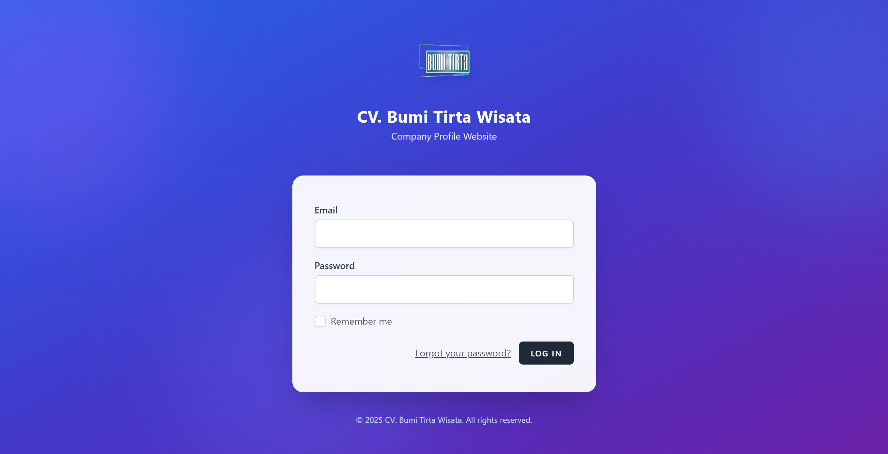
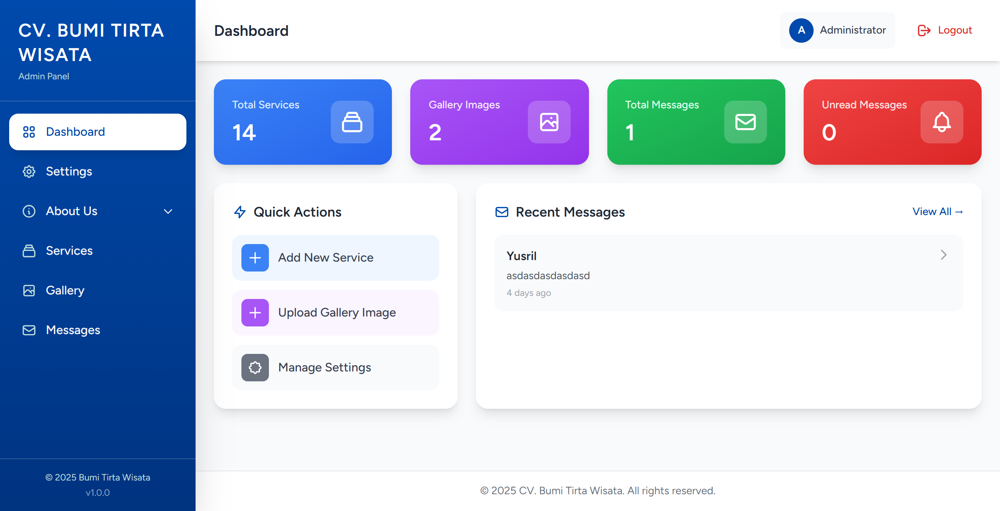
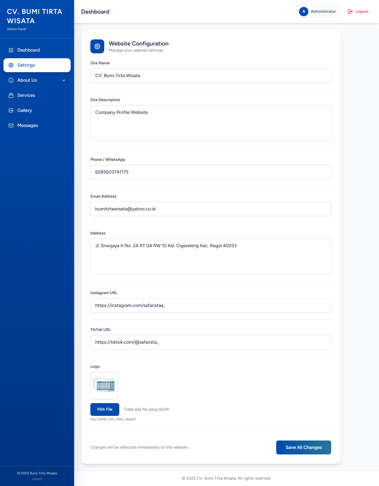
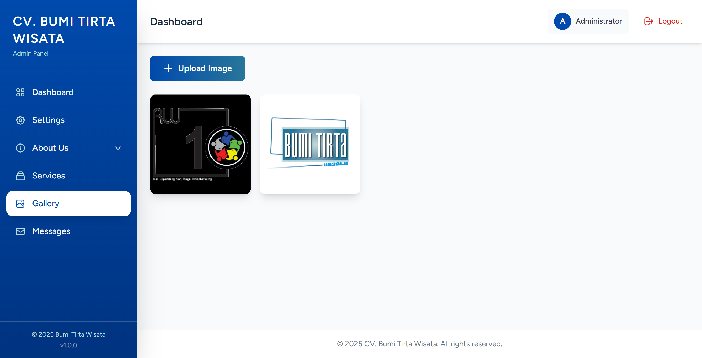
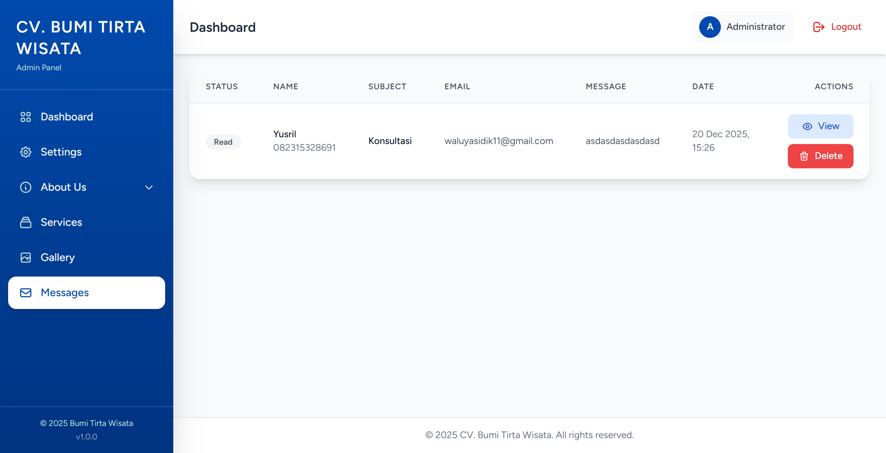
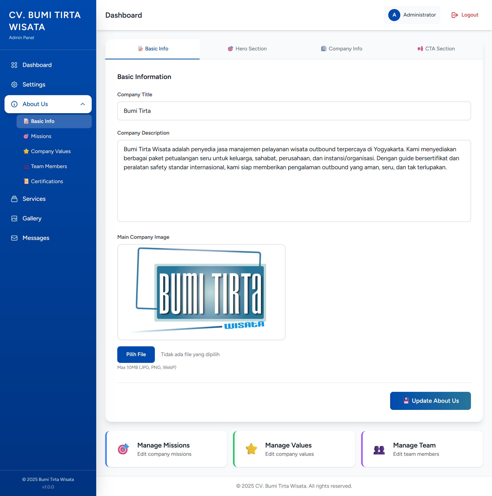
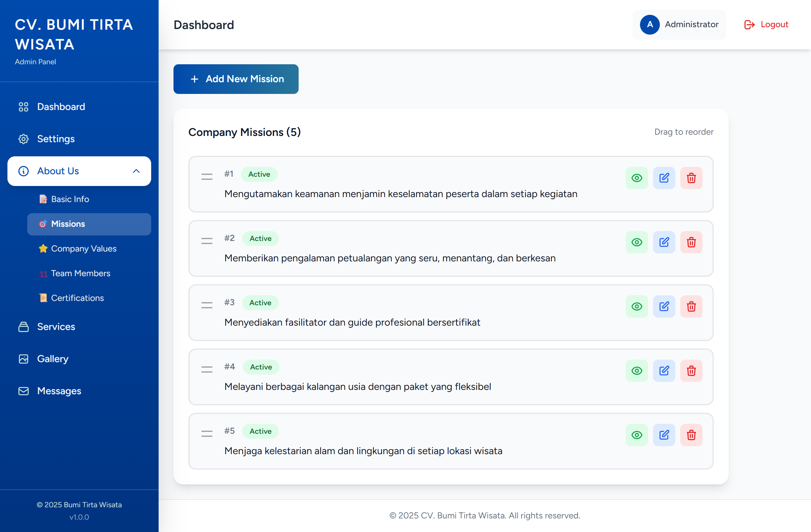
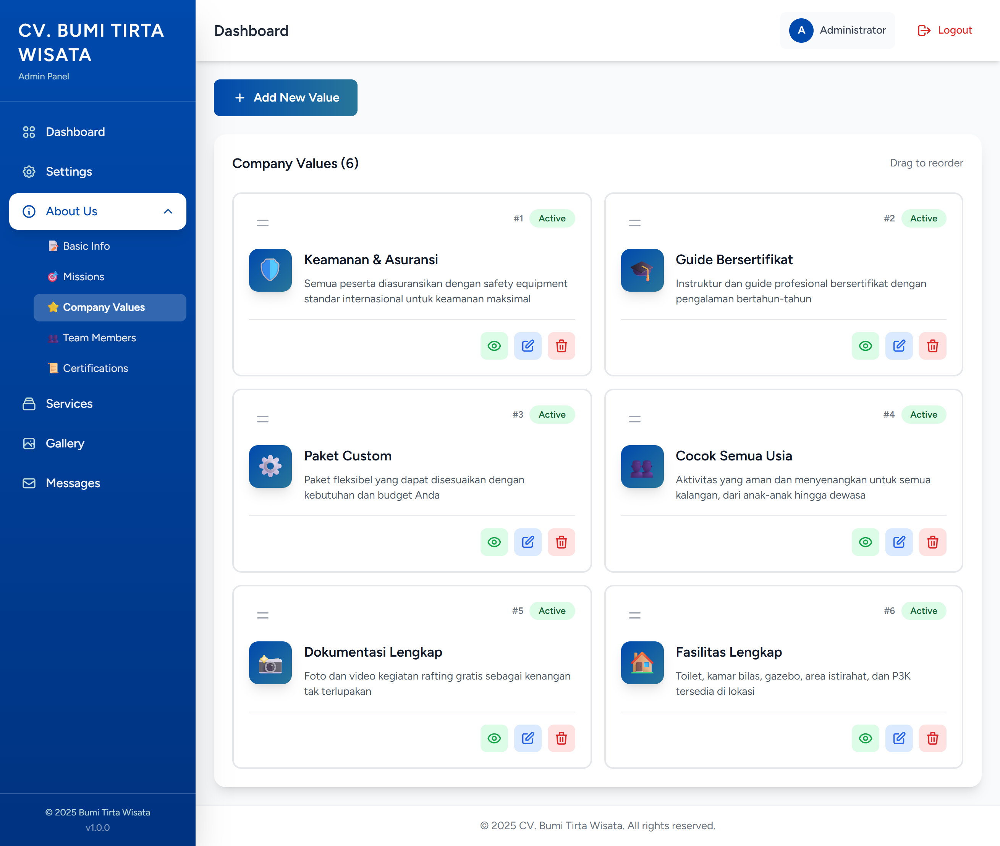
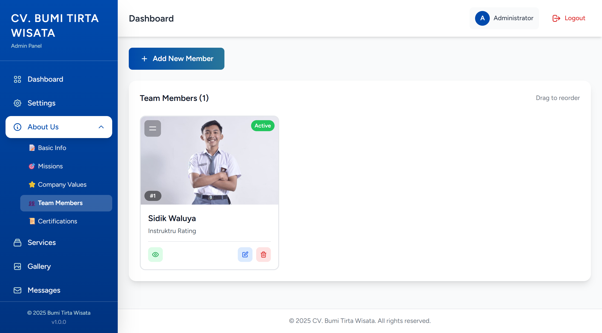
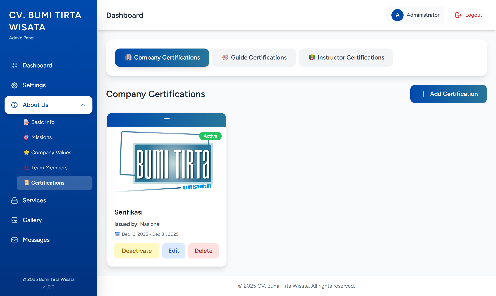

# Bumi Tirta Wisata 🌊

Selamat datang di repositori resmi **Bumi Tirta Wisata**. Aplikasi web ini dirancang untuk menampilkan keindahan dan layanan destinasi Bumi Tirta Wisata. Aplikasi ini mencakup frontend publik yang ramah pengguna untuk pengunjung dan panel admin yang komprehensif untuk pengelolaan konten.

## 🚀 Tentang Proyek

Bumi Tirta Wisata adalah aplikasi web modern yang dibangun dengan **Laravel 12**. Ini berfungsi sebagai gerbang digital bagi pengunjung untuk menjelajahi layanan, galeri, dan menghubungi pihak manajemen. Sistem ini dilengkapi dengan dashboard admin yang kuat yang memungkinkan administrator untuk mengelola konten situs web secara dinamis tanpa perlu menyentuh kode.

## ✨ Fitur

### 🌍 Antarmuka Publik (Pengunjung)
- **Beranda (Home)**: Halaman landing yang menarik dengan bagian hero dan sorotan utama.
- **Komponen**:
  - **Tentang Kami (About Us)**: Informasi mengenai perusahaan, misi, nilai-nilai, dan tim.
  - **Layanan (Services)**: Daftar detail layanan yang ditawarkan dengan halaman khusus untuk setiap layanan.
  - **Galeri (Gallery)**: Galeri foto yang menampilkan lokasi dan acara/kegiatan.
  - **Kontak (Contact)**: Formulir kontak fungsional bagi pengunjung untuk mengirim pesan langsung ke admin.

### 🛠 Dashboard Admin
- **Dashboard**: Ringkasan status sistem.
- **Sistem Manajemen Konten (CMS)**:
  - **Pengaturan Global**: Mengelola judul situs, deskripsi, info kontak, tautan media sosial, dan logo.
  - **Manajemen 'Tentang Kami'**:
    - Mengelola **Misi** dengan fitur pengurutan dan toggle visibilitas.
    - Mengelola **Nilai Perusahaan** (Company Values) dengan fitur pengurutan dan toggle.
    - Mengelola **Anggota Tim** dengan foto dan detail.
    - Mengelola **Sertifikasi**.
  - **Manajemen Layanan**: Membuat, mengedit, dan menghapus layanan dengan deskripsi teks kaya (rich text) dan upload gambar.
  - **Manajemen Galeri**: Mengunggah dan mengelola gambar untuk galeri publik.
- **Pusat Pesan**: Melihat dan mengelola pesan yang diterima dari formulir kontak.
- **Otentikasi**: Login/logout yang aman untuk administrator dengan manajemen profil.

## 🛠 Teknologi yang Digunakan

- **Framework**: [Laravel 12](https://laravel.com)
- **Bahasa**: PHP >= 8.2
- **Frontend**: Blade Templates, Tailwind CSS
- **Database**: MySQL
- **Assets Management**: Vite

## 📸 Tangkapan Layar (Screenshots)

### 🖥️ Tampilan Publik
Berikut adalah tampilan halaman yang dapat diakses oleh pengunjung umum:

| Beranda (Home) | Tentang Kami (About) |
|:---:|:---:|
|  |  |

| Layanan (Services) | Kontak (Contact) |
|:---:|:---:|
|  |  |

| Galeri (Gallery) | Halaman Login |
|:---:|:---:|
|  |  |

### ⚙️ Dashboard Admin
Berikut adalah tampilan panel kontrol untuk administrator:

| Dashboard Utama | Pengaturan Website |
|:---:|:---:|
|  |  |

| Manajemen Layanan | Manajemen Galeri |
|:---:|:---:|
|  |  |

| Pusat Pesan (Messages) | Edit Halaman About |
|:---:|:---:|
|  |  |

| Manajemen Misi | Manajemen Nilai Perusahaan |
|:---:|:---:|
|  |  |

| Manajemen Tim | Manajemen Sertifikasi |
|:---:|:---:|
|  |  |

## ⚙️ Instalasi

Ikuti langkah-langkah berikut untuk menjalankan proyek ini di komputer lokal Anda:

1.  **Clone repositori**
    ```bash
    git clone https://github.com/SidikWaluyaa/bumi-tirta.git
    cd bumi-tirta
    ```

2.  **Install dependensi PHP**
    ```bash
    composer install
    ```

3.  **Install dependensi NPM**
    ```bash
    npm install
    npm run build
    ```

4.  **Pengaturan Environment**
    ```bash
    cp .env.example .env
    php artisan key:generate
    ```
    *Sesuaikan pengaturan database Anda di dalam file `.env`.*

5.  **Jalankan Migrasi & Seeder**
    ```bash
    php artisan migrate --seed
    ```

6.  **Jalankan aplikasi**
    ```bash
    php artisan serve
    ```
